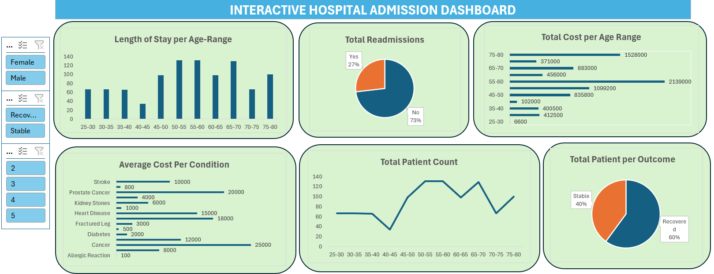
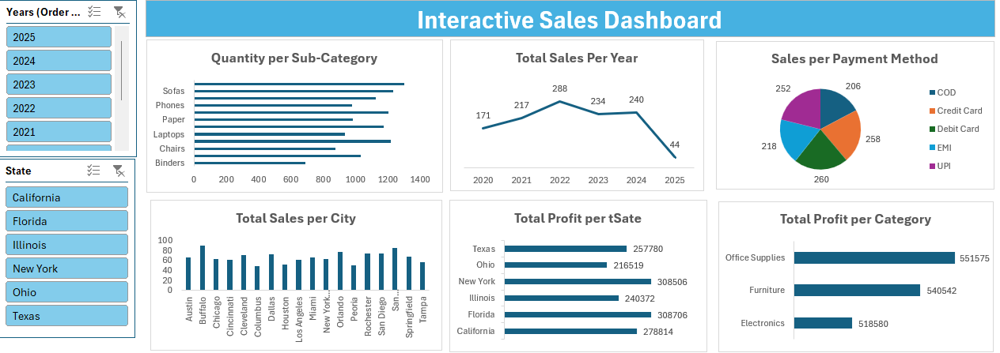

# Project 1

**Title:** [Hospital Admission Data Analysis Dashboard](https://github.com/Bett-Analyst/github.io/blob/main/Interactive%20Admission%20Dashboard.xlsx)

**Tools Used:** Microsoft Excel(Pivot Tables, Pivot Charts, Slicers, Timelines)

**Project Description:**

This project involved analyzing hospital admission data to identify trends and patterns in patient demographics, treatment costs, and health outcomes. It is designed to provide a comprehensive overview of key healthcare performance metrics. This interactive dashboard allows hospital administrators and stakeholders to easily monitor and evaluate operational efficiency, patient outcomes, and financial impact across various age groups and medical conditions.

The dashboard includes the following features:

**Length of Stay per Age Range:** Visual breakdown of average hospital stay durations categorized by age range, helping identify age groups requiring longer care.

**Total Readmissions:** Pie chart showing the proportion of patients readmitted, supporting efforts to monitor and reduce readmission rates.

**Total Cost per Age Range:** Bar chart highlighting the total treatment costs incurred per age group, offering insight into which demographics drive higher expenses.

**Average Cost per Condition:** Displays average treatment cost for various medical conditions (e.g., cancer, heart disease, diabetes), enabling comparison of resource allocation.

**Total Patient Count:** Line graph of patient volume by age group, helping to identify peak demand and service utilization.

Total Patients per Outcome: Pie chart comparing recovery versus stable patient outcomes, providing a snapshot of overall treatment effectiveness.

Additionally, the dashboard includes interactive slicers for:

**Gender:** Analyze data based on male or female patient populations.

**Outcome:** Filter by recovery or stability to focus on specific result categories.

Admission Score: Drill down using score-based segmentation for deeper analysis of admission severity and its correlation with other metrics.

**Key findings:**

**High-Cost Age Groups:** Identified the 55–60 and 75–80 age ranges as the most expensive in terms of total treatment cost, highlighting the need for targeted cost management strategies in these demographics.

**Length of Stay Correlation:** Found that patients in the 50–65 age group had the longest hospital stays, suggesting a direct correlation between age and duration of care that may require additional resources and planning.
Condition Cost Insights: Revealed that Cancer and Prostate Cancer are the most expensive conditions to treat, providing a focus for cost-control efforts and budgeting in oncology services.

**Readmission Rates:** Observed a 27% readmission rate, indicating an opportunity to improve post-discharge care and reduce avoidable hospital returns.

**Patient Outcome Distribution:** Noted that 60% of patients recovered while 40% remained stable, offering a baseline for evaluating treatment success and areas for clinical improvement.

**Age-Driven Demand:** Highlighted peak patient volume in the 50–60 age range, essential for workforce planning and optimizing hospital capacity.

This dashboard serves as a crucial tool for hospital management and healthcare analysts, offering clear, actionable insights to enhance patient care, manage costs, and support data-driven strategic planning.

**Project Overview**

# Project 2 

**Title:** Hospital Data Interogation and Manipulation

**SQL Code:** [Hospital SQL Code](https://github.com/Bett-Analyst/github.io/blob/main/Hospital_Data_Analysis)

**SQL Skills Used:** 

**Data Retrieval (SELECT):** Queried and extracted specific information from the database.

**Data Aggregation (SUM, COUNT):** Calculated totals, such as sales and quantities, and counted records to analyze data trends.

**Data Filtering (WHERE, BETWEEN, IN, AND):** Applied filters to select relevant data, including filtering by ranges and lists.

**Data Source Specification (FROM):** Specified the tables used as data sources for retrieval

**Project Description:** 

This project focuses on the analysis of a comprehensive dataset containing detailed information about 1,000 hospital patient records. The primary objective is to utilize SQL for extracting meaningful insights regarding patient demographics, medical conditions, procedures, costs, and outcomes.

**Database Design and Implementation:** Developed a relational database schema to effectively store and manage hospital patient data, ensuring normalization and referential integrity. The schema includes fields for patient demographics (age, gender), medical details (condition, procedure, cost, length of stay), and outcomes (readmission, outcome, satisfaction).

**Data Analysis Using SQL:**
*Employed SQL queries to analyze the dataset, including:*

Aggregating total costs by procedures and conditions to identify the most expensive treatments.
Calculating total length of stay by condition to understand hospitalization durations.
Counting patient distributions by gender and outcome to assess demographic and treatment outcome patterns.

**Insight Extraction:** Identified key patterns and trends within the data, such as:

**Top Costly Procedures and Conditions:** Identified procedures like Surgery and Chemotherapy and conditions like Cancer as the most expensive, highlighting high-cost areas in healthcare.
**Length of Stay Trends:** Found conditions like Cancer and Stroke associated with the longest hospital stays, indicating higher resource utilization.
Patient Demographics and Outcomes: Analyzed gender distribution and patient outcomes (Recovered vs. Stable), revealing balanced gender representation and a higher recovery rate among certain conditions.

**Reporting and Visualization:** Presented findings using comprehensive SQL query outputs to facilitate better understanding and decision-making. The results provide actionable insights for hospital administrators, enabling cost management, resource allocation, and improved patient care strategies.

By the end of this project, we aim to have a fully functional SQL database capable of providing in-depth analysis of hospital patient data, offering valuable insights for stakeholders such as hospital administrators, healthcare providers, and financial analysts.

**Technology used:** SQL server

# Project 3

**Title:** [Interactive Sales Dashboard](https://github.com/Bett-Analyst/github.io/blob/main/Interactive%20Sales%20Dashboard.xlsx)

**Tools Used:** Microsoft Excel(Pivot Tables, Pivot Charts, Slicers, Timelines)

**Project Description:**

This project involved analyzing hospital admission data to identify trends and patterns in patient demographics, treatment costs, and health outcomes. It is designed to provide a comprehensive overview of key healthcare performance metrics. This interactive dashboard, built using the "Interactive Sales Dashboard.xlsx" dataset, allows hospital administrators and stakeholders to easily monitor and evaluate operational efficiency, patient outcomes, and financial impact across various age groups and medical conditions. By leveraging advanced Excel functionalities, including pivot tables, charts, and slicers, the dashboard facilitates dynamic data exploration and supports data-driven decision-making in healthcare management.

**Key Features:**

**Length of Stay per Age Range:** Visual breakdown of average hospital stay durations categorized by age range, helping identify age groups requiring longer care.

**Total Readmissions:** Pie chart showing the proportion of patients readmitted, supporting efforts to monitor and reduce readmission rates.

**Total Cost per Age Range:** Bar chart highlighting the total treatment costs incurred per age group, offering insight into which demographics drive higher expenses.

**Average Cost per Condition:** Displays average treatment cost for various medical conditions (e.g., cancer, heart disease, diabetes), enabling comparison of resource allocation.

**Total Patient Count:** Line graph of patient volume by age group, helping to identify peak demand and service utilization.

**Total Patients per Outcome:** Pie chart comparing recovery versus stable patient outcomes, providing a snapshot of overall treatment effectiveness.

**Interactive Slicers:**

**Gender:** Analyze data based on male or female patient populations.

**Outcome:** Filter by recovery or stability to focus on specific result categories.

**Admission Score:** Drill down using score-based segmentation for deeper analysis of admission severity and its correlation with other metrics.

**Key findings:**

**High-Cost Age Groups:** Identified the 55–60 and 75–80 age ranges as the most expensive in terms of total treatment cost, highlighting the need for targeted cost management strategies in these demographics.

**Length of Stay Correlation:** Found that patients in the 50–65 age group had the longest hospital stays, suggesting a direct correlation between age and duration of care that may require additional resources and planning.

**Condition Cost Insights:** Revealed that Cancer and Prostate Cancer are the most expensive conditions to treat, providing a focus for cost-control efforts and budgeting in oncology services.

**Readmission Rates:** Observed a 27% readmission rate, indicating an opportunity to improve post-discharge care and reduce avoidable hospital returns.

**Patient Outcome Distribution:** Noted that 60% of patients recovered while 40% remained stable, offering a baseline for evaluating treatment success and areas for clinical improvement.

**Age-Driven Demand:** Highlighted peak patient volume in the 50–60 age range, essential for workforce planning and optimizing hospital capacity.

**Dashboard Overview:**

# Project 4

**Title:** [Students Perfromance Dashboard](https://github.com/Bett-Analyst/github.io/blob/main/Student%20Perfromance%20Dashboard.xlsx)

**Tools Used:** Microsoft Excel(Pivot Tables, Pivot Charts, Slicers, Timelines)

**Project Description:** 
This project involved analyzing student performance data to identify trends and patterns in academic habits, demographic factors, and exam outcomes. It is designed to provide a comprehensive overview of key educational performance metrics. This interactive dashboard allows educators and administrators to easily monitor and evaluate student engagement, academic success, and resource allocation across various age groups and participation levels.

The dashboard includes the following features:

**Extracurricular Impact**: Visual breakdown of exam scores categorized by extracurricular participation, helping identify its influence on student performance.

**Part-Time Job Effects**: Pie chart showing the proportion of students with part-time jobs and its correlation with exam scores and study hours, supporting efforts to optimize time management.

**Age Distribution**: Bar chart highlighting student count per age group, offering insight into demographic trends and performance variations.

**Gender Analysis**: Displays performance metrics across genders, enabling comparison of support needs and academic outcomes.

**Total Study Hours**: Line graph of study hours by part-time job status, helping to identify patterns in time allocation and academic effort.

**Total Students per Exam Score Range**: Pie chart comparing high versus low exam score distributions, providing a snapshot of overall academic effectiveness.

Additionally, the dashboard includes interactive slicers for:

**Gender**: Analyze data based on male, female, or other student populations.

**Extracurricular Participation**: Filter by participation status to focus on specific student categories.

**Exam Score**: Drill down using score-based segmentation for deeper analysis of performance trends and their correlation with habits.

**Key findings:**

**Extracurricular Impact on Scores**: Found that students not participating in extracurricular activities (62%) scored higher on average (72) compared to participants (29), suggesting a need for balanced scheduling to support academic focus.

**Part-Time Job Effects**: Observed that 21% of students with part-time jobs scored lower (19) compared to those without (79%, scoring 72), indicating potential challenges in managing work and study time effectively.

**Age-Based Performance Trends**: Highlighted that students aged 23–24 had the highest representation (13–15 students) and varied performance, providing a focus for age-specific academic support strategies.

**Gender Performance Insights**: Revealed that females (53%) slightly outperformed males (41%) with an average exam score difference of 5 points, offering a basis for tailored gender-based interventions.

**Study Hours Disparity**: Noted that students without part-time jobs studied 268.8 hours on average, while those with jobs studied 64.6 hours, underscoring the impact of work on study time availability.

**Exam Score Distribution**: Indicated that 60% of students scored above 70, while 40% scored below, providing a benchmark for academic improvement initiatives.

This dashboard serves as a crucial tool for educators and administrators, offering clear, actionable insights to enhance student support, optimize academic outcomes, and support data-driven educational planning.

**Dashboard Overview:**

